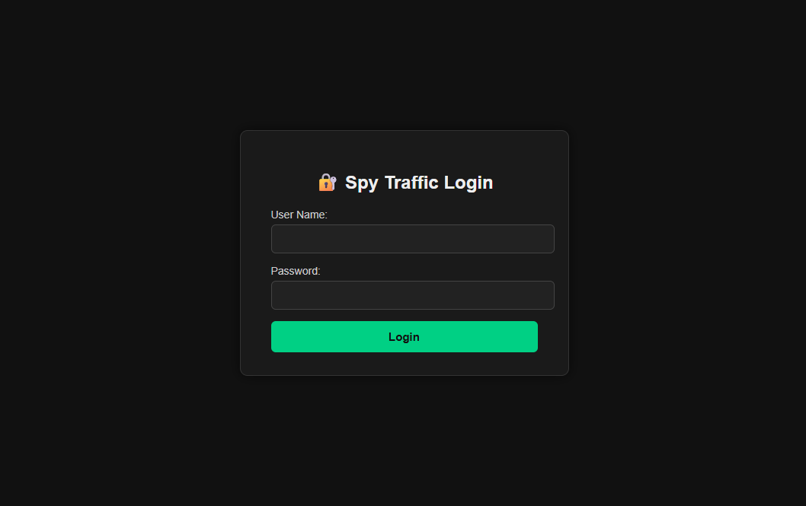
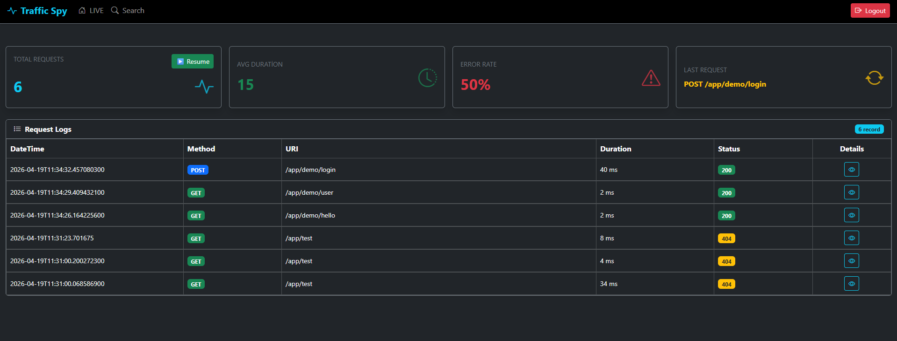
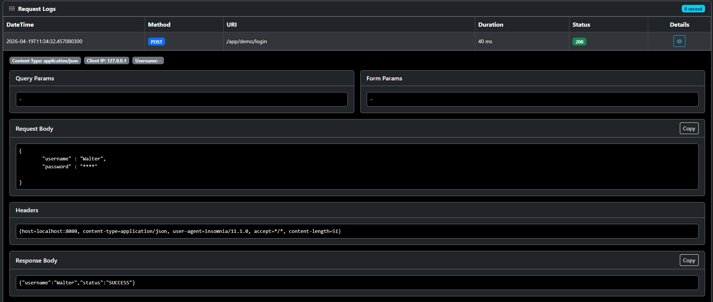
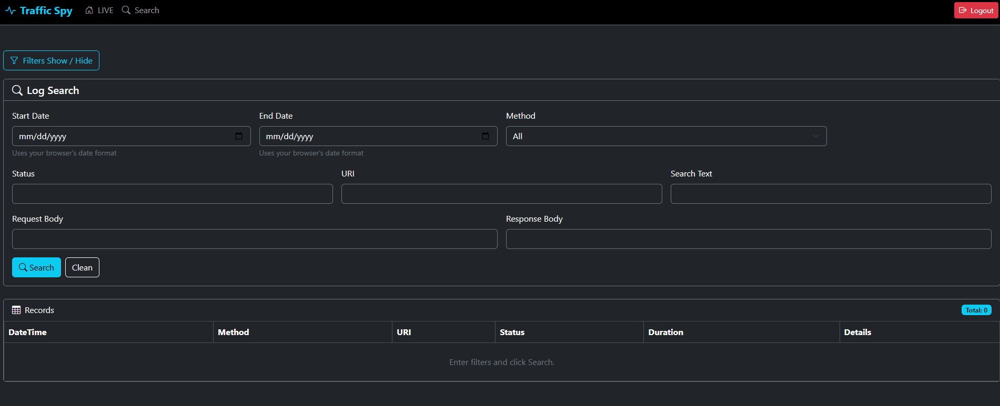

# 🚀 SpringSpy

Lightweight HTTP traffic inspection library for Spring Boot applications.

SpringSpy captures request/response traffic, stores it (memory + file), and provides a built-in UI for **live monitoring and search**.

---

## 🌐 Landing Page

🌐 [Visit SpringSpy Landing Page https://www.spyfcc.com](https://www.spyfcc.com) 

Explore features, screenshots, and usage examples on the official landing page.

[developer@spyfcc.com](mailto:developer@spyfcc.com)

---

## 📦 Maven Central

SpringSpy is available on Maven Central:

👉 https://search.maven.org/artifact/io.github.spyfcc/springspy

## ✨ Features

- 🔍 Capture HTTP request & response traffic
- 📊 Live monitoring dashboard
- 🔎 Advanced search screen
- 💾 File-based persistence
- 🔐 Built-in UI authentication (session-based)
- ⚡ Minimal setup (starter-based)
- 🧩 Spring Boot 2 & 3 support
- 🛣️ Context-path aware UI

---

## 📦 Modules

| Module     | Description |
|-----------|------------|
| core      | Event model, storage, search logic |
| starter2  | Spring Boot 2 integration (javax) |
| starter3  | Spring Boot 3 integration (jakarta) |
| ux        | Thymeleaf UI + static assets |

---

## ⚙️ Installation

### Spring Boot 3 (Jakarta)

```xml
<dependency>
    <groupId>io.github.spyfcc</groupId>
    <artifactId>spyfcc-starter3</artifactId>
    <version>1.0.0</version>
</dependency>
```

### Spring Boot 2 (Javax)

```xml
<dependency>
    <groupId>io.github.spyfcc</groupId>
    <artifactId>spyfcc-starter2</artifactId>
    <version>1.0.0</version>
</dependency>
```

---

## 📦 Other Build Tools (Gradle, etc.)

🌐 [View on Maven Central](https://search.maven.org/artifact/io.github.spyfcc/springspy) 

---

## 🚀 Quick Start

Add dependency and run your application.

Then open:

http://localhost:8080/spy

Login Page

<p align="center">
  
</p>

Live Monitoring

<p align="center">
  
</p>

Request Details

<p align="center">
  
</p>

Search Screen

<p align="center">
  
</p>


---

## 🔧 Configuration

```properties
traffic.spy.enabled=true
traffic.spy.ui-path=/spy
traffic.spy.file-path=./logs/spy
traffic.spy.memory-size=1000
traffic.spy.max-body-size=2048
traffic.spy.mask-sensitive=true
traffic.spy.security.username=spy
traffic.spy.security.password=spy123
traffic.spy.workingthread=2
```

---

## 🖥️ UI Screens

| Endpoint       | Description |
|---------------|------------|
| /spy/login    | Login page |
| /spy/logs     | Live traffic |
| /spy/search   | Search logs |

---

## ⚠️ Notes

- starter2 → uses javax
- starter3 → uses jakarta


---

## 🗺️ Roadmap

### 📌 Core Improvements
- Improve logging performance and structure
- Add advanced filtering & masking options

### 💾 Storage
- File-based logging (current)
- In-memory storage improvements
- Database integration (PostgreSQL / MongoDB)

### 🔍 Observability
- Advanced search capabilities
- Real-time monitoring enhancements
- Metrics & dashboard improvements

### 🤖 AI Features
- AI-powered log analysis
- Automatic anomaly detection
- Smart error grouping & summarization
- AI-based request insights (slow requests, failure patterns)


### 🌐 UI & UX
- UI improvements with better visualization
- Dark mode support
- Export logs (JSON / CSV)

---

## 📄 License

Apache License 2.0
